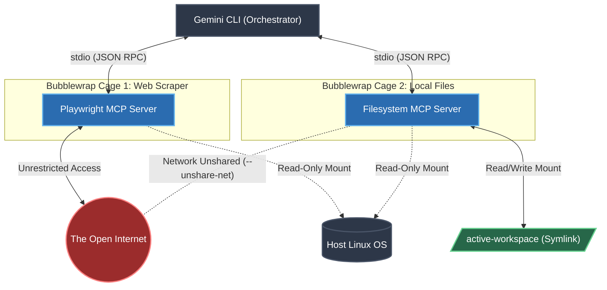

# Air-Gapped MCP Agents for Gemini CLI

## Overview
This repository provides a highly secure, dual-sandbox AI agent architecture implementing the Model Context Protocol (MCP). It is designed to be orchestrated by the Gemini CLI on Linux environments.

The primary objective of this project is to separate external network access from local filesystem access. By utilizing Linux Bubblewrap (`bwrap`), the system provisions two distinct unprivileged namespaces, ensuring that the web-scraping agent cannot access the host filesystem and the filesystem-management agent cannot communicate with external networks.

## Architecture

The system consists of two independent MCP servers communicating over `stdio`:

1.  **`playwright-mcp` (The Web Scraper)**
    *   **Function:** Navigates to URLs, extracts DOM text, and captures screenshots using a localized headless Chromium instance.
    *   **Security Posture:** Full network access is granted. The host filesystem is mounted strictly as read-only (`--ro-bind`). The agent cannot write to the disk.

2.  **`filesystem-mcp` (The Filesystem Manager)**
    *   **Function:** Lists directories, reads, writes, and deletes files within a dynamically specified target workspace.
    *   **Security Posture:** Network access is completely disabled (`--unshare-net`). Write access is restricted entirely to the active workspace folder. Application-level path validation prevents directory traversal (`../`) vulnerabilities.

## Prerequisites
To deploy this architecture, the host system must run a Linux distribution with the following dependencies installed:

*   **Node.js** (v18 or higher)
*   **npm** or **yarn**
*   **Bubblewrap** (`sudo dnf install bubblewrap`)
*   **Gemini CLI** (configured to accept MCP servers)

## Installation

### 1. Clone the Repository
```bash
git clone https://github.com/hitchgernn/my-gemini-agents.git
cd my-gemini-agents
```

### 2. Build the Playwright Server
The Playwright server requires a local installation of Chromium to avoid polluting the host system and to ensure the binary is accessible within the sandbox.

```bash
cd playwright-mcp
npm install
npm run build
PLAYWRIGHT_BROWSERS_PATH=0 npx playwright install chromium
cd ..
```

### 3. Build the Filesystem Server
```bash
cd filesystem-mcp
npm install
npm run build
cd ..
```

### 4. Ensure Execution Permissions
Verify that the bash scripts responsible for containerizing the Node environments are executable.

```bash
chmod +x playwright-mcp/start-secure.sh
chmod +x filesystem-mcp/start-secure.sh
```

## Configuration

### 1. Dynamic Workspace Targeting
The filesystem agent utilizes a symbolic link to determine its allowed read/write boundaries dynamically. This prevents the need to edit JSON configuration files when switching projects.

Create a bash alias to manage this symlink. Add the following to your `~/.bashrc` or `~/.zshrc`:

```bash
# Point the Gemini MCP to the current directory
alias focus-agent='ln -sfn $(pwd) /home/hitchgernn/projects/my-gemini-agents/active-workspace && echo "Agent workspace set to: $(pwd)"'
```

**Note:** Update the absolute path to match the location where you cloned the repository.

Reload your shell configuration:
```bash
source ~/.bashrc
```

### 2. Gemini CLI Integration
Update your Gemini CLI configuration file (e.g., `gemini_config.json`) to register the MCP servers. Point the filesystem agent's arguments to the dynamic symlink created in the previous step.

```json
{
  "mcpServers": {
    "playwright-secure": {
      "command": "/home/hitchgernn/projects/my-gemini-agents/playwright-mcp/start-secure.sh"
    },
    "filesystem-secure": {
      "command": "/home/hitchgernn/projects/my-gemini-agents/filesystem-mcp/start-secure.sh",
      "args": ["/home/hitchgernn/projects/my-gemini-agents/active-workspace"]
    }
  }
}
```

## Usage

### 1. Set the Target Workspace
Navigate to the directory where you want the AI to read or write files, and execute the targeting alias.

```bash
cd ~/Documents/my-current-project
focus-agent
```

### 2. Start the Orchestrator
Launch your Gemini CLI.

### 3. Execute Compound Prompts
You can now issue instructions that require both internet access and secure local file manipulation.

**Example Prompt:**
> "Use Playwright to scrape the latest release notes from the DomJudge GitHub repository. Summarize the changes and use the filesystem tool to save the summary as domjudge_updates.md in my current workspace."

## Troubleshooting

### Servers Show as "DisconUse the actions in the editor tool bar to either undo your changes or overwrite the content of the file with your changes.nected"
If the Gemini CLI fails to connect to the MCP servers, the Bubblewrap cage is likely failing to initialize.

*   **Node.js Path Resolution:** If you use NVM (Node Version Manager), your Node binary resides in your home directory, which Bubblewrap cannot access by default. Ensure your `start-secure.sh` scripts mount the correct `.nvm` path, or use a system-level Node installation.
*   **Zombie Processes:** If previous stdio connections did not terminate cleanly, orphaned processes may block new connections.
    ```bash
    killall node bwrap
    ```
*   **Debug Logging:** Append `2> mcp-crash.log` to the execution command within `start-secure.sh` to capture the standard error output from the sandbox.

### Files Saved in the Wrong Directory
If files are being written to the `filesystem-mcp` directory instead of your active project:

*   Verify the `active-workspace` symlink is pointing to the correct absolute path (`ls -la active-workspace`).
*   Ensure the `gemini_config.json` explicitly passes the symlink path in the `args` array.
